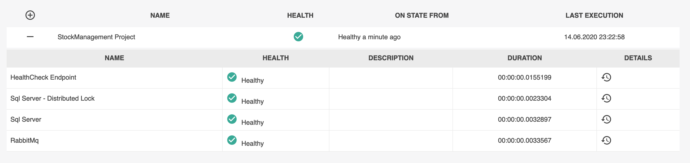

# Stock Management

This project is designed for managing stock operations for products. Project's use-cases are listed below:

- Adding a new product to stock
- Increasing the amount of a certain product in stock
- Decreasing the amount of a certain product in stock
- Reset stock of a certain product

### _Adding a new product to stock_

`ProductModel` class would be reflection of products in the ProductManagement project if ProductManagement project existed. If there exist a ProductManagement project, the StockManagement project would create `ProductModel` by observing `ProductCreatedIntegrationEvent`. In our case, `ProductModel` is created by the user's HTTP request [Post /products]. For every product, _InitializeStock_ action is saved into db. When _InitializeStock_ action is saved into db, `StockSnapShotModel` is also created and saved. When transactional operation is finished successfully, `StockSnapShotCreatedIntegrationEvent` is raised.

The StockManagement project is one of the observers which observe `StockSnapShotCreatedIntegrationEvent`. The StockManagent project creates `StockModel` for each event. This model is used for only read operations.

### _Increasing the amount of a certain product in stock_

ProductId, Count, and CorrelationId values are required to increase the amount of a certain product in stock. CorrelationId is required to ensure that this operation is executed only once. When __AddToStock__ operation is finished successfully, `StockCountIncreasedIntegrationEvent` is raised.

`StockModel`'s _AvailableStock_ value will be updated by the StockManagement project when `StockCountIncreasedIntegrationEvent` is observed.

### _Decreasing the amount of a certain product in stock_

ProductId, Count, and CorrelationId values are required to decrease the amount of a certain product in stock. CorrelationId is required to ensure that this operation is executed only once. When __RemoveFromStock__ operation is finished successfully, `StockCountDecreasedIntegrationEvent` is raised.

`StockModel`'s _AvailableStock_ value will be updated by the StockManagement project when `StockCountDecreasedIntegrationEvent` is observed.

### _Reset stock of a certain product_

ProductId and CorrelationId values are required to reset stock of a certain product. CorrelationId is required to ensure that this operation is executed only once. __ResetStock__ operation is similar to _RemoveFromStock_ operation. When __ResetStock__ operation is finished successfully, `StockCountDecreasedIntegrationEvent` is raised.

## __RUN__

__Way 1__

The project could be executed via _docker-compose_. If you have an IDE which is capable of debugging _docker-compose file_, _docker-compose.yml_ whic is located at the main directory would  be useful for you.

In case of choosing this way to run the project, you can reach swagger screen via _http://localhost:2020_.

Note: Because the sql server needs more time to be ready compared to StockManager-Api, it might take a while for you to reach the endpoints after `docker-compose up` command execution.

__Way 2__

If you want to execute the project without using docker, it is required that you set the connection strings inside the StockManagement/appsettings.json file.

Changes to be made are:
1. DbConfig -> DbOptions -> ConnectionStr value should be changed with the Sql Server connection string that you have.
2. DistributedLockConfig -> DistributedLockOptions -> ConnectionStr value should be changed with the Sql Server connection string that you have.
3. MassTransitConfig -> MassTransitOptions -> HostName, VirtualHost, Username, Password values should be changed with the RabbitMq platform information that you have.

In the first item if the connection string information is invalid, application will crash immediately. In order to check if the remaining settings are valid, you can use http://localhost:5000/healthchecks_ui endpoint.

